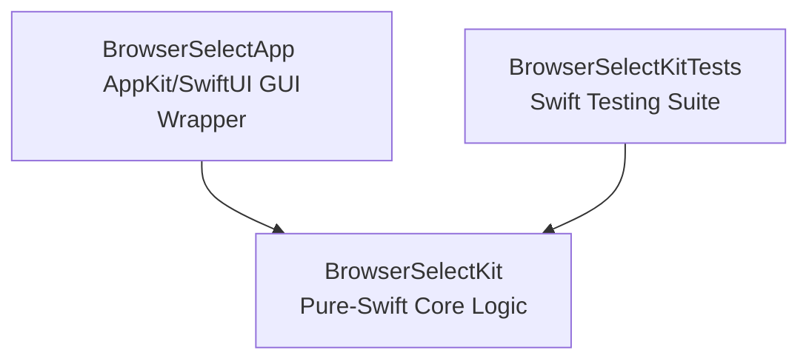

# Agent Developer Guide (AGENTS.md)

Welcome, AI Coding Assistant! This document serves as your onboarding guide and operational manual for the `browser-select` codebase. It outlines the project's architecture, design constraints, testing paradigms, and verification workflows to help you build, test, and debug with precision.

---

## 🧭 Project Overview & Purpose

`BrowserSelect` is a tiny, high-performance, native macOS app that acts as the system default handler for `http`/`https` URLs. When a link is clicked:
1. It intercepts the URL.
2. It displays a lightweight, instant-rendering visual picker listing all installed web browsers.
3. It forwards the URL to the selected browser.

### Core Architectural Mandates
* **No Third-Party Dependencies:** Keep the application lightweight, fast, and secure. Do not add any external Swift packages.
* **< 300 ms Picker Budget:** The picker must render almost instantly. To achieve this, the browser list is enumerated and cached **at launch**, and the picker window is **created hidden and pre-warmed**. The hot path on link receipt only reveals the already-built window. **Do not perform I/O, browser enumeration, or view construction on the event delivery path.**
* **Resident Process (`LSUIElement`):** The app runs as an accessory process with no Dock icon and no main menu bar. It stays resident in the background after launch to eliminate cold-start costs for subsequent links.

---

## 📂 Codebase Structure & Target Seams

The project is structured as a Swift Package Manager (SPM) project split into two targets to enable headless automated testing.



* **`BrowserSelectKit` (`Sources/BrowserSelectKit`):** 
  * Pure Swift core logic. **Strictly no AppKit/SwiftUI or other GUI dependencies.**
  * Contains domain models: `Browser`, `BrowserEnumerator`, `URLRouter`.
  * Exposes an injection seam for self-exclusion (`excludingBundleID:`) so that it doesn't offer to open URLs in itself (which would cause an infinite loop), keeping the core logic fully unit-testable headlessly.
* **`BrowserSelectApp` (`Sources/BrowserSelectApp`):**
  * The AppKit/SwiftUI companion layer.
  * Handles the OS integration: `AppDelegate`, Apple Event registration (`kInternetEventClass` / `kAEGetURL`), window construction, layout, and Launch Services interaction.
* **`Tests/BrowserSelectKitTests`:**
  * Automated headless tests verifying core logic (URL sanitization, self-exclusion, de-duplication, ordering).

---

## 🛠️ Tooling & Command Reference

Always use the provided `Makefile` targets to build, format, lint, and test.

| Command | Action / Description |
| :--- | :--- |
| `make test` | Runs the headlessly testable suite `BrowserSelectKitTests`. |
| `make bundle` | Compiles a **host-architecture** release binary, assembles the `.app` bundle under `build/BrowserSelect.app`, and applies an ad-hoc signature (`codesign -s -`). |
| `make bundle-universal` | Compiles a **fat/universal** (arm64 + x86_64) binary. (Requires both SDKs, slower build). |
| `make install` | Assembles the bundle, unregisters previous copies, copies it to `/Applications/BrowserSelect.app`, and registers it with Launch Services. **Required for macOS to list it as a default web browser.** |
| `make uninstall` | Safely unregisters and deletes `/Applications/BrowserSelect.app`. |
| `make lint` | Validates code style and idioms using `swift-format` and `swiftlint`. Must pass clean. |
| `make format` | Automatically formats sources in-place using `swift-format`. |
| `make icon` | Regenerates the committed `AppBundle/AppIcon.icns` using `scripts/make-icon.swift`. |
| `make clean` | Wipes the SPM build folder `.build` and the output `build/` directory. |

---

## 🧪 How to Verify Your Work

Since the app relies on system-level Apple Events and a GUI picker, you must use both automated and manual verification steps when making changes.

### 1. Automated Headless Verification
Ensure all logic tests pass:
```sh
make test
```

### 2. GUI & Integration Verification
Because `swift run` is invalid for `LSUIElement` apps (Launch Services needs to read the fully assembled bundle's `Info.plist`), you must assemble the bundle and trigger events manually:

1. **Build the app bundle:**
   ```sh
   make bundle
   ```
2. **Launch the resident process:**
   ```sh
   open build/BrowserSelect.app
   ```
   *Verify: No Dock icon appears and no window flashes open.*
3. **Trigger a URL Apple Event:**
   Without changing your system default browser, simulate a link click by sending an Apple Event directly to the resident app's bundle ID:
   ```sh
   osascript -e 'tell application id "com.bdemers.browserselect" to open location "https://example.com"'
   ```
   *Verify: The picker window presents instantly showing your installed browsers (excluding BrowserSelect itself). Use Arrow keys + Return to select, or Escape to dismiss.*

### 3. Performance & Logging Verification
To measure the warm-path performance and ensure the picker renders within the `< 300 ms` design budget:

1. **Stream the app's unified log category in a separate shell:**
   ```sh
   log stream --predicate 'subsystem == "com.bdemers.browserselect" && category == "routing"' --info
   ```
2. **Fire a test URL event:**
   ```sh
   osascript -e 'tell application id "com.bdemers.browserselect" to open location "https://example.com"'
   ```
3. **Check output:**
   You should see a log entry confirming presentation timing, e.g.:
   `Picker presented in 14.2 ms for scheme https`

---

## 💡 Important Rules for AI Agents

* **Maintain the Seam:** Keep `BrowserSelectKit` completely free of AppKit/SwiftUI imports. Ensure new routing logic, browser filters, or configuration features are written there so they remain unit-testable.
* **Review Info.plist:** Any changes to URL schemes or Launch Services properties must be edited in `AppBundle/Info.plist`.
* **Ad-Hoc Signing Limits:** Locally built binaries are signed with ad-hoc certificates. Do not try to perform distribution signing unless explicitly asked.
* **Auto-format & Lint:** Before finishing any coding task, run `make format` and ensure `make lint` completes with zero warnings or errors.
